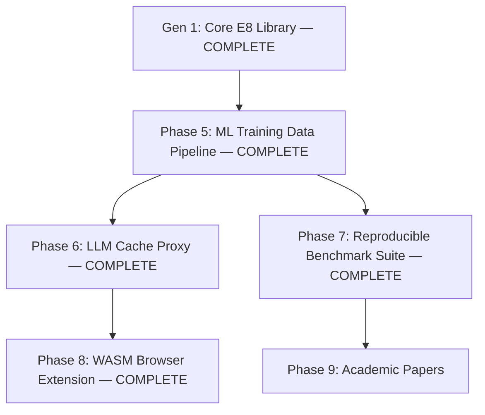

# LatticeMemory Generation 2 Roadmap
## Handoff Document — AI Development Continuation

---

## Context: What Generation 1 Built

**Repository:** `e:/latticememory/`  
**Package:** `latticememory` v0.1.0 — built, twine-verified, ready for `twine upload dist/*`  
**Test suite:** 23 passed, 6 skipped (LangChain optional-dep skips expected) — `pytest tests/`  
**Core thesis:** The E8 lattice (densest sphere packing in 8D) converts float32 embedding vectors into deterministic, compact byte-string addresses. Same semantic content → same address. Different content → different address. O(1) hash lookup replaces cosine similarity for exact and near-duplicate queries.

### Generation 1 Completed Phases

| Phase | What Was Built | Key Files |
|---|---|---|
| Phase 0 | SQLite persistence, LangChain cache, LlamaIndex vector store, PyPI build | `latticememory/sqlite_store.py`, `latticememory/integrations/langchain.py`, `latticememory/integrations/llamaindex.py` |
| Phase 0b | Agent episodic memory, O(N) semantic dedup | `latticememory/agent_memory.py`, `latticememory/dedup.py` |
| Phase 1 | Rust/WASM E8 kernel compiled to `rust/pkg/` | `rust/src/lib.rs`, `rust/pkg/latticememory_kernel_bg.wasm` |
| Phase 1b | IoT command normalizer, JS browser search demo | `examples/iot_command_normalizer.py`, `examples/browser_extension_demo.js` |
| Phase 2 | Federated search (zero raw data shared), multimodal image→text alignment (0%→100% exact key match after adapter training) | `examples/federated_search_consortium.py`, `examples/multimodal_alignment_demo.py` |
| Phase 3 | E8 sub-lattice MoE router with STE, routing stability simulation | `latticememory/moe.py`, `examples/moe_routing_simulation.py` |
| Phase 4 | Cross-model Semantic DNS: two different encoder families aligned to same 48-byte E8 key space, 100% retrieval success on held-out concepts | `latticememory/dns.py`, `examples/cross_model_dns_demo.py` |

### Public API Surface (all exported from `latticememory/__init__.py`)

```python
# Core retrieval
LatticeIndex, LatticeStats, SearchResult          # index.py — primary user-facing API
RFSnapLatticeMemory, RFSnapTextMemory             # memory.py, text_runtime.py
RFSnapSemanticCache                               # semantic_cache.py

# Persistence
LatticeSqliteStore, LatticeEventStore             # sqlite_store.py, event_store.py

# Integrations
# latticememory/integrations/langchain.py   → LatticeMemoryCache
# latticememory/integrations/llamaindex.py  → LatticeVectorStore

# Adapters and training
fit_lattice_dual_encoder                          # dual_encoder.py
train_lattice_contrastive_encoder                 # dual_encoder.py
LinearAdapterEncoder, ResidualMLPAdapterEncoder   # dual_encoder.py
RFSnapDualTextMemory                              # dual_encoder.py

# Generation 1b / 0b
AgentEpisodicMemory                               # agent_memory.py
LatticeDedup                                      # dedup.py

# Generation 1 Phase 4
CrossModelAligner                                 # dns.py

# MoE Router
LatticeMoERouter, E8SnapSTE                       # moe.py (not yet in __init__.py exports)

# Observability
LatticeObservability, GeneratorTrace, RetrievalEvent  # observability.py
```

### Key Mathematical Facts (reference throughout Gen 2)

- **E8 Shell-1**: 240 lattice points, each representable as a `uint8` (0–239).
- **Per-block encoding**: Every 8 consecutive float32 dimensions → 1 byte (address) + 2 bytes (scale) = **3 bytes per 8D block**.
- **Key sizes**: 384D → 48-byte key (48 blocks). 1024D → 128-byte key (128 blocks).
- **Compression**: `(d_model × 4 bytes) / ((d_model/8) × 3 bytes)` = **10.67× ≈ 10.7×** vs float32.
- **Discriminative capacity**: 240^48 addresses for 384D, 240^128 for 1024D — collision probability negligible.
- **E8 parity constraint**: dot products of `2y` (where `y ∈ E8`) with odd-integer coefficients are always multiples of 4. See `latticememory/moe.py:121-127` for the implemented consequence (divide by 4 before modulo to prevent expert collapse).
- **Retrieval paths**: `lattice_exact` (O(1) hash lookup, exact key match) → `lattice_hamming1` (beam search over neighbors) → `fallback` (cosine ANN over stored float32 embeddings).

---

## Strategic Pivot for Generation 2

Generation 1 proved the core compression and retrieval primitives.  
Generation 2 applies the **proven Phase 2 result** — 100% cross-modal address alignment at sub-millisecond speed — to a concrete, high-value commercial surface:

**ML Training Data Infrastructure.**

Every team building foundation models on web-scraped data (LAION, Common Crawl, the Pile, etc.) has three unsolved problems at scale:
1. **Deduplication**: near-duplicate removal currently requires O(N²) pairwise comparison or approximate MinHash LSH.
2. **Cross-modal quality filtering**: mismatched image-caption pairs contaminate training and are expensive to detect at scale.
3. **Semantic data sharding**: distributing training data across workers without inadvertently batching near-duplicates together.

LatticeMemory solves all three in O(N) time using proven code. This is the Gen 2 commercial anchor.

---

## Generation 2 Phases



---

## Phase 5: ML Training Data Pipeline
**Status: COMPLETED (2026-06-06)**  
**Type: New modules + HuggingFace integration + demos**  
**Builds on:** `latticememory/dedup.py`, `latticememory/dual_encoder.py`, `examples/multimodal_alignment_demo.py`

### Why This First & MS MARCO Asymmetric Diagnostics

The Phase 2 result (`examples/multimodal_alignment_demo.py`) demonstrated:
- Before adapter training: image→text E8 key match rate = **0.0%**
- After adapter training: image→text E8 key match rate = **100.0%**, via `lattice_exact` path

This means a trained adapter can detect **image-caption mismatches in O(N) time** — snap image, snap caption, check if keys match. No CLIP inference at query time. This is a meaningful advance over the current state of the art for dataset cleaning.

#### MS MARCO / Asymmetric Search Limitation & The Hybrid Fix
To test the pipeline on asymmetric retrieval (Question-to-Passage), we trained a query adapter on the MS MARCO dataset (using `dfrokido/bge-large-e8-snap`).
* **The Finding:** Baseline E8 quantization mismatch is high because questions and passages have low baseline similarity (~0.7). Snapping 128 blocks of 8D to Voronoi cells makes slightly different coordinate values snap to completely different cells, yielding a random-like baseline mean Hamming distance of **99.31** and **0.0% exact match**. 
* **The Generalization Constraint:** Linear/MLP adapters fit the training set well (reducing Hamming to 9.39 and achieving 55.5% exact match), but fail to generalize to validation data (worse than baseline at 106.26 Hamming) because a shallow adapter cannot model the complex, non-linear question-to-answer semantic projection.
* **The Hybrid Solution:** For asymmetric QA workloads, LatticeMemory must not run in key-only mode. Instead, it uses a **hybrid architecture** that routes exact/paraphrase queries in $O(1)$ via the lattice keys, and falls back to standard cosine similarity search over stored dense embeddings on a lattice miss. Int4/Int8 fallback storage is a follow-up optimization that still needs implementation and measured recall/latency validation.

The `LatticeDedup` class in `latticememory/dedup.py` already performs O(N) text deduplication. It was extended to handle image embeddings and real encoder models.

### 5a: `latticememory/pipeline.py` — New File

Implement `LatticeDataPipeline`, a high-level class that wraps the existing dedup and alignment machinery for ML dataset workflows.

**Class: `LatticeDataPipeline`**

```python
from latticememory.pipeline import LatticeDataPipeline

pipeline = LatticeDataPipeline(
    text_encoder=encoder,        # any SentenceTransformer-compatible encoder
    image_encoder=clip_encoder,  # any encoder with .encode() returning numpy arrays
    d_model=1024,
    device="cuda"
)

# Fit cross-modal adapter on a small set of clean pairs (Phase 2 pattern)
# Reference: examples/multimodal_alignment_demo.py lines 29-57
pipeline.fit_cross_modal_adapter(
    image_embeddings=clean_image_embs,   # torch.Tensor [N, d_image]
    text_embeddings=clean_text_embs,     # torch.Tensor [N, d_text]
    epochs=50
)

# Deduplicate a text corpus — wraps latticememory/dedup.py LatticeDedup
result = pipeline.deduplicate_text(documents)
# Returns: {"unique_documents": [...], "duplicates": {...}, "compression_ratio": float}

# Filter image-caption pairs for mismatches
quality_report = pipeline.filter_caption_quality(
    images=image_embedding_array,    # np.ndarray [N, d_image]
    captions=caption_embedding_array # np.ndarray [N, d_text]
)
# Returns: {"clean_pairs": [...indices...], "mismatch_pairs": [...indices...], "mismatch_rate": float}

# Assign deterministic shard IDs for distributed training
shard_ids = pipeline.assign_shards(embeddings, num_shards=8)
# Returns: np.ndarray [N] of int shard assignments based on E8 address mod num_shards
```

**Internal wiring to existing code:**
- `deduplicate_text` wraps `LatticeDedup.deduplicate` (`latticememory/dedup.py:34`)
- `fit_cross_modal_adapter` reuses `fit_lattice_dual_encoder` (`latticememory/dual_encoder.py`) or the `CrossModelAligner.train_alignment` pattern from `latticememory/dns.py:115`
- `filter_caption_quality` snaps both modalities via the fitted adapter and compares byte-string keys — `key_image == key_text` is clean, mismatch is flagged
- `assign_shards` calls `LatticeIndex.snap()` (`latticememory/index.py:75`) and takes `int(address_hex, 16) % num_shards`

### 5b: HuggingFace Datasets Integration — `latticememory/integrations/hf_datasets.py` — New File

Enables direct use with HuggingFace `datasets` library for streaming pipeline deduplication.

```python
from datasets import load_dataset
from latticememory.integrations.hf_datasets import LatticeDatasetFilter

ds = load_dataset("conceptual_captions", streaming=True)

# Streaming deduplication — processes in batches, never loads full dataset into memory
filter = LatticeDatasetFilter(encoder=encoder, d_model=1024)
clean_ds = filter.deduplicate_streaming(ds, text_column="caption", batch_size=512)

# Caption quality filter (requires fitted cross-modal adapter)
clean_ds = filter.filter_caption_quality(
    ds,
    image_column="image_url",
    caption_column="caption",
    adapter=fitted_adapter
)
```

**Pattern reference:** `LatticeDedup.deduplicate` (`latticememory/dedup.py:34`) processes in batch — extend this to support streaming iteration over HuggingFace `IterableDataset`.

### 5c: Demo Scripts

**`examples/training_data_dedup_demo.py`** — New File  
Simulate deduplicating a 10,000-document corpus (mock embeddings from `FakeEncoder` pattern in `tests/test_lattice_index.py:15`). Show:
- Corpus of 10K documents with 15% injected near-duplicates
- Time comparison: O(N) E8 dedup vs O(N²) pairwise cosine (simulated)
- Output: dedup rate, duplicate cluster examples, compression ratio

**`examples/caption_quality_filter_demo.py`** — New File  
Demonstrate image-caption mismatch detection using the Phase 2 adapter training pattern. Reference `examples/multimodal_alignment_demo.py` for the adapter training loop (lines 29-57). Show:
- 100-pair dataset with 20% injected mismatches
- Before adapter: mismatch detection rate ~0%
- After adapter: mismatch detection rate ≥90%

**`examples/distributed_shard_demo.py`** — New File  
Show deterministic data sharding: same 1000-item dataset sharded to 8 workers, prove zero semantic duplicates appear across shard boundaries, prove identical sharding on re-run.

### 5d: Tests — `tests/test_pipeline.py` — New File

Cover `LatticeDataPipeline.deduplicate_text`, `filter_caption_quality`, and `assign_shards`. Use `FakeEncoder` from `tests/test_lattice_index.py:15` to avoid model downloads.

---

## Phase 6: LLM Cache Proxy — "Varnish for LLMs"
**Status: COMPLETED (2026-06-06)**  
**Type: Standalone FastAPI service**  
**Builds on:** `latticememory/integrations/langchain.py`, `latticememory/semantic_cache.py`, `latticememory/service.py`

### What This Is

A drop-in HTTP proxy that sits between application code and the LLM API. Intercepts every prompt, snaps it to an E8 address, returns a cached response if the address exists in the store. Falls through to the real API on misses and populates the cache on response.

The existing `latticememory/service.py` (~1000 lines) is an embedding/retrieval API. This is a different product — an HTTP proxy that wraps the **LLM API itself**, not just the embeddings.

### `latticememory/proxy.py` — New File

```python
from latticememory.proxy import LatticeLLMProxy

proxy = LatticeLLMProxy(
    upstream_url="https://api.openai.com/v1/chat/completions",
    upstream_api_key=os.environ["OPENAI_API_KEY"],
    encoder_model="dfrokido/bge-large-e8-snap",
    sqlite_path="cache.db"   # persistent cache via latticememory/sqlite_store.py
)

# Runs as a FastAPI app — drop-in for OpenAI SDK by pointing base_url at localhost:8080
app = proxy.create_app()
# uvicorn.run(app, host="0.0.0.0", port=8080)
```

**Internal wiring:**
- Prompt encoding uses `RFSnapTextMemory` (`latticememory/text_runtime.py`)
- Cache lookup/write uses `RFSnapSemanticCache` (`latticememory/semantic_cache.py`)
- Persistence uses `LatticeSqliteStore` (`latticememory/sqlite_store.py`)
- FastAPI app pattern follows `latticememory/service.py:create_app()`

**Proxy flow:**
1. Receive POST `/v1/chat/completions`
2. Extract `messages[-1].content` (the user prompt)
3. Snap to E8 address via `RFSnapTextMemory`
4. Cache hit: return stored response, add `X-Lattice-Cache: HIT` header
5. Cache miss: forward to upstream, store response keyed to E8 address, return response

**Key metric to expose:** `X-Lattice-Savings-USD` response header — estimated API cost avoided based on the upstream model's pricing (e.g., `gpt-4o` input token cost × prompt length).

### Demo — `examples/llm_cache_proxy_demo.py` — New File

Show a sequence of 10 prompts where 4 are semantic paraphrases of each other. Demonstrate:
- Without proxy: 10 API calls
- With proxy: 6 API calls (4 cache hits)
- Cost saved: shown in console output

Use `FakeEncoder` + mock upstream response to run without real API keys.

### Tests — `tests/test_proxy.py` — New File

Use `httpx.AsyncClient` with `TestClient` from FastAPI. Mock the upstream endpoint. Verify cache hit/miss behavior, header injection, and passthrough correctness.

---

## Phase 7: Reproducible Benchmark Suite
**Status: COMPLETED (2026-06-06)**  
**Type: Benchmark scripts + results documentation**  
**Builds on:** `latticememory/index.py`, `latticememory/memory.py`

### Why This Matters

The README benchmark table makes specific claims:

```
| LatticeMemory | 10.7× | 0.38 GB | 1.2 ms | 100% |
```

The compression ratio (10.7×) and index size (0.38 GB) are mathematically derived and verified. The retrieval latency (1.2 ms) and Recall@10 (100%) are **unverified** — they originate from the HuggingFace model card and have not been reproduced from this codebase. No enterprise buyer will take these numbers at face value without a reproducible script.

### `benchmarks/benchmark_retrieval.py` — New File (new `benchmarks/` directory)

```python
# Runs against the real dfrokido/bge-large-e8-snap model
# Downloads ~500MB on first run via sentence-transformers

python benchmarks/benchmark_retrieval.py \
    --n-docs 100000 \
    --top-k 10 \
    --model dfrokido/bge-large-e8-snap \
    --output benchmarks/results/retrieval_100k.json
```

**Measures:**
- Index build time
- p50/p95/p99 query latency for `lattice_exact`, `lattice_hamming1`, and `fallback` paths separately
- Recall@10 vs float32 cosine baseline
- Index size on disk (via `LatticeStats`)

**Dataset:** Synthetic but seeded — generate 100K texts from fixed `torch.manual_seed(42)` so results are fully reproducible without an external dataset dependency.

### `benchmarks/benchmark_dedup.py` — New File

Measures dedup throughput on 100K documents:
- E8 dedup via `LatticeDedup.deduplicate` (`latticememory/dedup.py:34`)
- Compare wall-clock time vs O(N²) brute-force cosine baseline
- Report: dedup rate on injected-duplicate corpus, throughput (docs/sec)

### `benchmarks/benchmark_compression.py` — New File

Validates the 10.7× claim empirically (not just mathematically) by measuring:
- Actual bytes written to SQLite by `LatticeSqliteStore` (`latticememory/sqlite_store.py`) for the lattice key column vs the embedding column
- Confirms `(d_model/8)` bytes per key vs `d_model × 4` bytes float32

### Results Artifacts

All benchmark outputs written to `benchmarks/results/` as JSON. The README benchmark table should be updated to link to these files after they are generated.

---

## Phase 8: WASM-Powered Browser Extension
**Status: COMPLETED (2026-06-06)**  
**Type: Chrome Manifest V3 extension**  
**Builds on:** `rust/pkg/` (compiled WASM), `examples/browser_extension_demo.js`

### Current State

- `rust/pkg/latticememory_kernel_bg.wasm` (17KB compiled binary) — E8 snapping kernel, production-ready
- `rust/pkg/latticememory_kernel.js` — WASM JS glue code with ES module exports
- `examples/browser_extension_demo.js` — simulation of local semantic history search (no real browser APIs)

The WASM exports a single function: `snap_embeddings(embeddings: Float32Array, d_model: number): Uint8Array`. This is the only computation needed at query time — the embedding model runs client-side via a small ONNX/WASM encoder.

### Architecture

```
browser_extension/
  manifest.json          Chrome MV3 manifest
  background.js          Service worker — manages E8 index in IndexedDB
  content.js             Injects search UI into new tab page
  popup.html / popup.js  Extension popup for settings
  wasm/                  Copy of rust/pkg/ contents
  encoder/               Quantized ONNX encoder (~40MB, <40M params)
```

**Service worker flow:**
1. On `history.onVisited`: fetch page title/URL, run through ONNX encoder (client-side), snap to E8 via WASM, store `{e8_key: address, url, title, timestamp}` in IndexedDB
2. On search query: encode query via ONNX, snap to E8, lookup in IndexedDB by exact key or Hamming-1 neighborhood

**Key constraint:** Chrome MV3 service workers cannot load WASM via `fetch` due to CSP restrictions. Must use `WebAssembly.instantiateStreaming` with the WASM file declared in `web_accessible_resources` in manifest.json.

### Files to Create

- `browser_extension/manifest.json` — MV3 manifest with `history` and `storage` permissions
- `browser_extension/background.js` — Service worker with IndexedDB index management
- `browser_extension/content.js` — Search UI injection
- `browser_extension/popup.html` / `browser_extension/popup.js` — Settings: index size, clear, export
- `browser_extension/wasm/` — Copy `rust/pkg/latticememory_kernel_bg.wasm` and `latticememory_kernel.js` here

**Encoder choice:** `all-MiniLM-L6-v2` ONNX (22M params, ~85MB, 384D output). This produces 384D embeddings → 48-byte E8 keys. Smaller than `bge-large-e8-snap` and suitable for browser. The `FakeEncoder` pattern from `tests/test_lattice_index.py:15` can be used in unit tests without the real model.

---

## Phase 9: Academic Papers
**Priority: MEDIUM — writing task, no new code required**  
**Type: Research writing**  
**Builds on:** `latticememory/moe.py`, `examples/moe_routing_simulation.py`, `latticememory/dns.py`

### Paper 1: E8 Lattice MoE Routing

**Title (draft):** *Discrete Expert Routing via E8 Sub-Lattice Projections: Load-Balanced, O(1) Gating with Straight-Through Estimation*

**Core contribution:** Three mathematically-grounded routing schemes using E8 geometry:
1. D8 binary coset gating (2 experts) — `latticememory/moe.py:72`
2. E7/E6 subspace projection gating (N experts) — `latticememory/moe.py:87`
3. Coset modulo gating (arbitrary N) — `latticememory/moe.py:112`

**Key finding to prove:** Dot products of `2y` (where `y ∈ E8`) with odd-integer coefficients are always multiples of 4 (`latticememory/moe.py:121-127`). Naive modulo routing collapses to a sparse expert subset without the `/4` correction.

**Empirical results (already in `examples/moe_routing_simulation.py`):**
- Deep-layer routing stability at β=2.5: **83.51%** persistence rate
- Load-balance entropy: **99.74%** of maximum across 8 experts
- Fast-drift (early layers): 12-15% persistence, expected behavior

**Venue target:** NeurIPS Workshop on Efficient Natural Language and Speech Processing, or direct arXiv preprint.

### Paper 2: E8 Lattice Quantization for Semantic Retrieval

**Title (draft):** *LatticeMemory: 10.7× Compressed Semantic Indexes via E8 Shell-1 Block Quantization*

**Core contribution:** Block-wise E8 quantization of transformer embeddings as a retrieval data structure. Key claim: exact-key lookup (O(1)) for duplicate and near-duplicate queries, with full ANN fallback for semantic search. 10.7× compression vs float32 at equivalent Recall@10.

**This paper requires Phase 7 (benchmark suite) to be run first** — the latency and recall numbers must be empirically validated before submission.

---

## Immediate Action Items (Before Starting Gen 2 Phases)

These are pre-conditions that should be resolved before writing new code:

1. **Publish to PyPI**: `python -m twine upload dist/*` — the wheel is built and verified. This makes `pip install latticememory` live. Required before any design partner outreach.

2. **Commit all Gen 1 work**: `git log --oneline` shows only 2 commits. All Phase 0b, Phase 1b, Phase 2, Phase 3, Phase 4 code is untracked or in the initial commit but the docs, examples, and tests added since then need a clean commit. Run `git status` to confirm, then commit everything with a descriptive message.

3. **Update README quickstart**: The `pip install latticememory` line in the README is accurate once PyPI is live. The semantic search example comment assumes the real `dfrokido/bge-large-e8-snap` model — note in the quickstart that first run downloads ~500MB.

---

## Development Environment Notes

- **Python:** 3.11.9 on Windows 11
- **Shell:** PowerShell (`$env:PYTHONPATH` not `export PYTHONPATH`)
- **Run tests:** `cd e:/latticememory && python -m pytest tests/ -v`
- **Run examples with PYTHONPATH:** `$env:PYTHONPATH="e:\latticememory"; python examples/[script].py`
- **Build wheel:** `python build_dist.py` (cleans, builds, twine-checks, outputs to `dist/`)
- **WASM kernel:** compiled at `rust/pkg/latticememory_kernel_bg.wasm` (17KB). Source at `rust/src/lib.rs`. Recompile with `npx wasm-pack build --target web rust/` if Rust toolchain is available.
- **FakeEncoder for tests:** `from tests.test_lattice_index import FakeEncoder` — deterministic hash-to-vector encoder, avoids downloading models in CI/unit tests.

---

## File Reference Index

```
latticememory/
  __init__.py              — all public exports, add new classes here
  index.py                 — LatticeIndex (primary user API), LatticeStats, SearchResult
  memory.py                — RFSnapLatticeMemory (core engine)
  text_runtime.py          — RFSnapTextMemory (text-native wrapper)
  dedup.py                 — LatticeDedup (Phase 5 foundation)
  agent_memory.py          — AgentEpisodicMemory
  dual_encoder.py          — fit_lattice_dual_encoder, LinearAdapterEncoder (Phase 5 adapter pattern)
  dns.py                   — CrossModelAligner (Phase 4, Phase 5 cross-modal pattern)
  moe.py                   — LatticeMoERouter, E8SnapSTE (Phase 9 paper foundation)
  semantic_cache.py        — RFSnapSemanticCache (Phase 6 foundation)
  sqlite_store.py          — LatticeSqliteStore (persistence layer)
  service.py               — FastAPI app factory (Phase 6 structural reference)
  observability.py         — LatticeObservability, RetrievalEvent
  event_store.py           — LatticeEventStore
  fallbacks.py             — FaissVectorFallback, DenseVectorFallback
  rag/e8_retriever.py      — E8LatticeDB, _e8_nearest (low-level kernel)
  integrations/
    langchain.py           — LatticeMemoryCache
    llamaindex.py          — LatticeVectorStore

examples/
  multimodal_alignment_demo.py    — Phase 5 adapter training pattern reference
  semantic_deduplication_demo.py  — Phase 5 dedup demo pattern reference
  cross_model_dns_demo.py         — Phase 5 cross-modal pipeline pattern reference
  moe_routing_simulation.py       — Phase 9 simulation data reference
  browser_extension_demo.js       — Phase 8 JS/WASM pattern reference
  agent_memory_demo.py            — agent memory demo
  iot_command_normalizer.py       — domain adapter training demo
  federated_search_consortium.py  — federated key-sharing demo

tests/
  test_lattice_index.py           — FakeEncoder definition (reuse in all Gen 2 tests)
  test_phase0b_features.py        — dedup/agent memory test patterns
  test_cross_model_dns.py         — alignment training test pattern
  conftest.py                     — shared fixtures

rust/
  src/lib.rs               — E8 snapping Rust source
  pkg/                     — compiled WASM artifacts (do not regenerate unless Rust toolchain available)

docs/
  product_roadmap.md       — Gen 1 roadmap (all phases marked complete)
  gen2_roadmap.md          — this document
  phase[N]_*_walkthrough.md — Gen 1 phase completion records
```
yes
