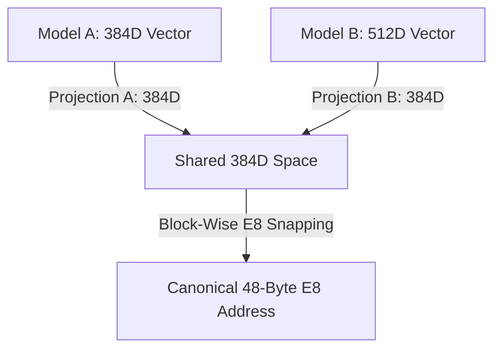

# Implementation Plan: Phase 4 (Cross-Model Semantic DNS)

This plan outlines the steps to build **Phase 4** of the LatticeMemory roadmap: a prototype of a Cross-Model Semantic DNS, enabling two completely different embedding model families to resolve concepts to the exact same multi-block E8 lattice addresses, facilitating index migration without re-indexing.

---

## Goal Description

Because vector embeddings are model-bound, Model A (e.g. 384D) and Model B (e.g. 512D) represent the same concept in incompatible coordinate spaces. Under standard quantization, they snap to completely different E8 addresses. This makes index databases non-portable: if a company upgrades or deprecates a model, they must re-index their entire corpus.

A **Semantic DNS** acts as a model-agnostic registry. Instead of collapsing vectors to a single 8D block (which acts as a simple classifier with only 240 buckets), we project both models into a **shared multi-block space** (e.g. $D_{shared} = 384$ dimensions, yielding 48-byte E8 keys). We can then resolve the same concept to the **exact same 48-byte E8 address** regardless of which model generated the input vector.

---

## Technical Architecture

We will train two projection layers ($W_A: \mathbb{R}^{384} \to \mathbb{R}^{384}$ and $W_B: \mathbb{R}^{512} \to \mathbb{R}^{384}$) using a joint contrastive alignment objective:
1. **Gradients via STE**: We use the Straight-Through Estimator (`E8SnapSTE`) to propagate gradients directly through the block-wise nearest-point E8 snapping operation.
2. **Contrastive Gating Loss**: Drives positive concept pairs (same concept under Model A and Model B) to snap to the identical E8 lattice coordinate.
3. **Discriminative Capacity**: Because the shared space is 384-dimensional, it is processed as 48 independent 8D blocks. This gives $240^{48}$ potential addresses, ensuring that distinct concepts remain separated and do not suffer from bucket collisions.

---

## Proposed Changes

### [latticememory](file:///e:/latticememory/latticememory)

#### [NEW] [dns.py](file:///e:/latticememory/latticememory/dns.py)
* Implement `CrossModelAligner` as a PyTorch module:
  * `__init__(self, d_model_a: int, d_model_b: int, d_shared: int = 384)`
  * Projections for Model A (`proj_a`) and Model B (`proj_b`) to `d_shared`.
  * `forward_a(self, emb_a: Tensor) -> Tensor`: Projects and snaps Model A embedding.
  * `forward_b(self, emb_b: Tensor) -> Tensor`: Projects and snaps Model B embedding.
  * `train_alignment(self, pairs_a: Tensor, pairs_b: Tensor, epochs: int = 100, lr: float = 0.01) -> float`:
    * Minimizes a contrastive alignment loss over the STE-snapped vectors to push positive pairs to snap to the identical E8 address.

#### [MODIFY] [__init__.py](file:///e:/latticememory/latticememory/__init__.py)
* Expose `CrossModelAligner` at the package level.

---

### [examples](file:///e:/latticememory/examples)

#### [NEW] [cross_model_dns_demo.py](file:///e:/latticememory/examples/cross_model_dns_demo.py)
* Simulate an **Index Migration / Model Upgrade** scenario:
  * Let Model A (384D) represent a smaller legacy encoder.
  * Let Model B (512D) represent a newer, larger upgrading encoder.
* Generate a dataset of 100 paired semantic concepts (using mock embeddings with small semantic perturbations).
* Split concepts into 70 training pairs and 30 validation (unseen) pairs.
* Demonstrate that:
  1. **Before Alignment**: Snapping Model A and Model B embeddings directly yields 0.0% address match rate on the validation set.
  2. **After Alignment**: The aligner maps the held-out validation pairs to the **exact same** 48-byte E8 key address, resolving different models to the same conceptual address.
  3. **Index Retrieval**: Show that query vectors from the new Model B successfully retrieve documents that were indexed using the legacy Model A *without* re-indexing the database.

---

## Verification Plan

### Automated Run
* Run `python examples/cross_model_dns_demo.py`.
* Verify that:
  * The aligner successfully runs its training loop.
  * The address match rate for unseen validation concepts jumps from 0.0% to a high matching percentage (e.g., >80%).
  * Existing unit tests continue to pass.
