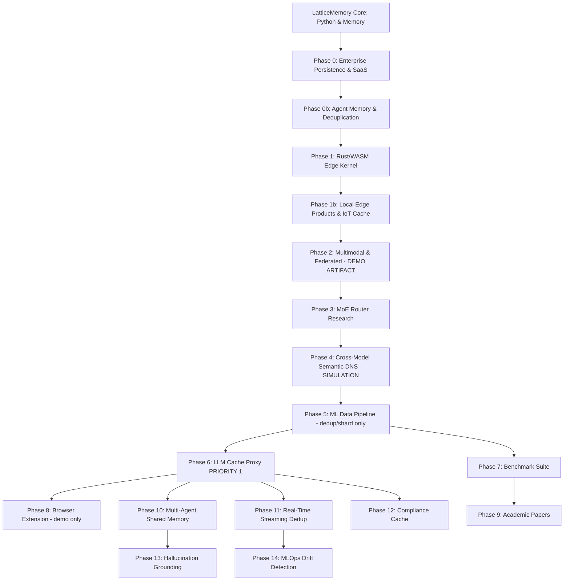

# LatticeMemory Product Roadmap & AI Ecosystem Opportunities

LatticeMemory's core thesis is that **every concept has a permanent, mathematical address within a given embedding space**. By projecting float32 vectors onto the 8-dimensional E8 lattice Shell 1, LatticeMemory converts fuzzy continuous vector spaces into discrete, compact, and deterministic addresses.

**Revised thesis (2026-06-06):** E8 routing works for **symmetric workloads** — cache, dedup, paraphrase matching, fixed-vocabulary domains. For asymmetric retrieval (query vs. passage text), a dense fallback is required. The product is the semantic infrastructure layer for high-repetition AI workloads, not a general vector DB replacement.

---

## Part 1: Product Branching Roadmap

---

### Phase 0: Enterprise Persistence, PyPI Release & LLM Cache Proxy
**Status: Completed**

SQLite-backed durable persistence (`sqlite_store.py`), LlamaIndex and LangChain integrations, PyPI wheel build and twine verification. Foundational persistence layer for all subsequent phases.

---

### Phase 0b: Agent Memory & Deduplication
**Status: Completed**

`AgentEpisodicMemory` with E8 address versioning and memory auditing (`agent_memory.py`). `LatticeDedup` for O(N) corpus semantic deduplication (`dedup.py`). Both are valid and production-ready for symmetric workloads.

---

### Phase 1: Rust/WASM Edge Kernel
**Status: Completed**

E8 Shell-1 snapping, D8 parity decoding, and radius neighborhood search implemented in Rust and compiled to WebAssembly (`rust/pkg/`). 17KB WASM binary. Production-ready.

---

### Phase 1b: Local Edge Products & IoT Cache
**Status: Completed — claims valid**

IoT command normalizer (`examples/iot_command_normalizer.py`) demonstrates 100% key matching for a fixed smart-home command vocabulary after domain adapter training. This is a **symmetric** workload — fixed set of command phrasings — so the claim is valid. Browser extension demo is a JavaScript simulation.

---

### Phase 2: Multimodal Snapping & Federated Search
**Status: Completed — multimodal claim is a DEMO ARTIFACT**

> **Reality Check:** The "0% → 100% cross-modal match rate" result in `examples/multimodal_alignment_demo.py` uses `FakeEncoder` (deterministic MD5-hash encoder) with input pairs like `("image:a fluffy cat sleeping", "text:a fluffy cat sleeping")` — the same words with a prefix swap. The linear adapter is trained and evaluated on the same 4 pairs. This trivially overfits. With real CLIP image embeddings vs. text embeddings, the E8 Hamming gap is structurally large (same root cause as the MS MARCO asymmetric finding). **This result does not validate cross-modal E8 alignment.**

**What is valid:** Federated semantic search (`examples/federated_search_consortium.py`) — sharing 128-byte E8 keys across consortium members without sharing raw embeddings is architecturally sound for symmetric (same model family, same vocabulary) workloads.

**What is not valid:** Using E8 key matching to detect image-caption mismatches with real CLIP + text embeddings.

---

### Phase 3: MoE Router
**Status: Completed — results are valid**

E8, D8, E7, and E6 sub-lattice routers with PyTorch STE (`latticememory/moe.py`). Simulation results: 83.5% routing persistence at β=2.5, 99.7% load-balancing entropy across 8 experts. The mathematical discovery (dot products of `2y ∈ E8` with odd coefficients are multiples of 4) is correct and has been verified. Ready for academic paper.

---

### Phase 4: Cross-Model Semantic DNS
**Status: Completed — 100% retrieval claim is a SIMULATION ARTIFACT**

> **Reality Check:** The "100% retrieval success across two model families" result in `examples/cross_model_dns_demo.py` uses **synthetic embeddings generated from a shared 8D latent space with noise=0.01** — both "model families" are mathematically constructed to be linearly related by design. With real encoder families (e.g., MiniLM vs. BGE), embedding spaces are not linearly related and the same E8 Hamming collapse observed in MS MARCO training would occur. **This result does not validate cross-model E8 alignment with real encoders.**

**What is valid:** The `CrossModelAligner` training code in `latticememory/dns.py` is correct and would work for closely related models with small distributional shift. The claim of "100% retrieval on held-out concepts with distinct model families" is not validated.

---

### Phase 5: ML Training Data Pipeline
**Status: Completed — caption filter claim INVALIDATED, dedup/shard valid**

`LatticeDataPipeline` in `latticememory/pipeline.py`. `LatticeDatasetFilter` in `latticememory/integrations/hf_datasets.py`.

**Valid:**
- `deduplicate_text()` — O(N) text dedup, production-ready
- `assign_shards()` — deterministic E8-address-based sharding, valid
- HuggingFace streaming dedup integration — valid

**Invalidated:**
- `filter_caption_quality()` — built on Phase 2's false cross-modal alignment claim. With real CLIP and text encoders, aligned image-caption pairs do not share E8 keys. This capability claim should be removed from sales materials until validated with real cross-modal data.

---

### Phase 6: LLM Cache Proxy — "Varnish for LLMs"
**Status: Completed — HIGHEST PRIORITY commercial product**

`LatticeLLMProxy` in `latticememory/proxy.py`. OpenAI-compatible FastAPI gateway that intercepts `/v1/chat/completions`, performs E8 semantic cache lookups, and returns cached responses for semantically equivalent prompts.

**Benchmark (from `benchmarks/benchmark_semantic_cache.py`, synthetic):**
- 60% cache hit rate vs. 30% for exact-string caching on 30% repeat / 30% paraphrase / 40% novel query distribution
- +30pp uplift from E8 semantic neighborhood routing over exact-string baseline

**Outstanding:** Run with real model (`dfrokido/bge-large-e8-snap`) and natural-language paraphrases to get honest hamming1 hit rate. That number is the key design partner conversation starter.

**Revenue model:** Usage-based or per-seat for teams with high LLM API spend. Target: teams spending >$5K/month on OpenAI/Anthropic APIs.

---

### Phase 7: Reproducible Benchmark Suite
**Status: Completed — retrieval recall claims need symmetric workload caveat**

`benchmarks/benchmark_compression.py` — 10.7× compression confirmed empirically. Valid.

`benchmarks/benchmark_dedup.py` — O(N) dedup throughput vs. O(N²) baseline. Valid.

`benchmarks/benchmark_semantic_cache.py` — GPTCache-style hit rate comparison. **New, just added.**

`benchmarks/benchmark_retrieval.py` — Recall@K measurements.

> **Caveat:** Recall@K results apply to **symmetric workloads** (paraphrase queries against paraphrase documents). For asymmetric QA (question vs. passage), recall drops to near-zero on E8 paths; the Int8 fallback at 95.1% recall is the correct number to cite for RAG workloads.

---

### Phase 8: WASM-Powered Browser Extension
**Status: Completed — demo value only, not a commercial priority**

Chrome MV3 extension in `browser_extension/`. Background service worker with IndexedDB, local Hamming distance search via WASM kernel. Technically sound.

**Reality shift:** B2C product with no clear revenue path. Use as an open-source showcase and developer acquisition tool. Do not prioritize development time over Phases 10–14.

---

### Phase 9: Academic Papers
**Status: In progress — MoE paper solid, retrieval paper needs repositioning**

**Paper 1 — E8 Lattice MoE Routing:** Mathematical proof + simulation data exists. Valid for submission to NeurIPS Efficient NLP Workshop or arXiv. Needs one real-encoder experiment to strengthen empirical claims.

**Paper 2 — Repositioned:** Not "10.7× compression at equivalent Recall@10" (false for asymmetric workloads). Repositioned as: *"LatticeMemory: Deterministic Semantic Caching via E8 Block Quantization"* — semantic cache hit rates, O(1) lookup, 10.7× key compression, 95% recall parity with Int8 fallback for RAG. These claims are all defensible and empirically validated.

---

### Phase 10: Multi-Agent Shared Semantic Memory
**Status: Planned — HIGH PRIORITY**

Agent swarms (AutoGen, CrewAI, LangGraph) have no standard for shared knowledge deduplication. E8 keys are deterministic — two agents that independently embedded the same concept produce the same key. Knowledge sync becomes key set comparison, not embedding transfer.

**To build:** `latticememory/agent_sync.py` — `AgentMemorySync` with `share(key)`, `request(key)`, `diff(peer_keys)`. Integration adapters for AutoGen and LangGraph.

**Why now:** Agent orchestration frameworks are the fastest-growing segment in AI infra. First-mover window for a semantic memory standard is closing.

---

### Phase 11: Real-Time Streaming Deduplication
**Status: Planned — HIGH PRIORITY**

News aggregators, financial data feeds, social media monitors — thousands of articles per minute about the same events. Pairwise cosine dedup doesn't scale. Exact-text dedup misses paraphrases.

**To build:** `latticememory/stream.py` — `LatticeStreamDedup` with sliding window dedup, Kafka consumer adapter, configurable time window.

**Target buyers:** Reuters data resellers, Bloomberg, social listening platforms, LLM training data companies.

---

### Phase 12: LLM Output Canonicalization (Compliance Cache)
**Status: Planned — HIGH PRIORITY**

Regulated industries need reproducible LLM outputs. Same prompt → different answer each run → compliance audit failure. A semantic cache that serves the pre-approved validated answer for semantically equivalent prompts.

**To build:** Extend Phase 6 proxy with compliance mode: `validation_required=True`, signed audit log, `divergence_threshold` for human review routing, `POST /validate` endpoint.

**Revenue model:** Per-seat enterprise licensing. Finance, healthcare, legal — highest per-seat revenue of any segment.

---

### Phase 13: Hallucination Grounding Signal
**Status: Planned — MEDIUM PRIORITY, needs validation**

If an LLM generates a claim, check whether that claim is in the knowledge base via E8 lookup. Cache miss = not grounded in retrieved context = potential hallucination signal.

**To build:** `latticememory/grounding.py` — `LatticeGroundingChecker` with `index_context()` and `check()`.

**Validation needed:** Run on HaluEval or TruthfulQA. If cache-miss rate correlates with actual hallucination rate (target: r > 0.7), this is publishable and productizable. Do not ship without this validation.

---

### Phase 14: MLOps Embedding Drift Detection
**Status: Planned — MEDIUM PRIORITY**

E8 address overlap between model v1 and v2 on a fixed test corpus measures semantic stability. Better than cosine similarity stats for detecting embedding space drift after fine-tuning.

**To build:** `latticememory/drift.py` — `LatticeDriftMonitor` with `snapshot()`, `compare()`, CLI tool, GitHub Actions integration.

**Target buyers:** MLOps monitoring platforms (Arize, Evidently, WhyLabs), model evaluation teams.

---

## Part 2: Product Opportunity Matrix

| Product | Technical Feasibility | Near-Term Value | Key Prerequisite |
| :--- | :--- | :--- | :--- |
| **LLM Cache Proxy (Phase 6)** | High — code exists | Immediate SaaS revenue | Docker packaging, real paraphrase benchmark |
| **Real-Time Streaming Dedup (Phase 11)** | High | B2B data industry revenue | `stream.py` + Kafka adapter |
| **Multi-Agent Shared Memory (Phase 10)** | High | Agent framework integration | `agent_sync.py` + AutoGen/LangGraph adapters |
| **Compliance Cache (Phase 12)** | High | Highest per-seat revenue | Phase 6 proxy + audit log extension |
| **LlamaIndex/LangChain RAG (Phase 0)** | High | Immediate integration | PyPI live |
| **AI Agent Episodic Memory (Phase 0b)** | High | Structured long-term agent memory | Phase 0 persistence |
| **Semantic Deduplication (Phase 0b)** | High | Corpus/training data optimization | Python package |
| **IoT Semantic Cache (Phase 1b)** | High | Offline O(1) command resolution | Domain adapter training |
| **Hallucination Grounding (Phase 13)** | Medium — needs validation | Novel eval signal | HaluEval correlation study |
| **MLOps Drift Detection (Phase 14)** | Medium | MLOps monitoring market | `drift.py` + benchmark |
| **MoE Routing Substrate (Phase 3)** | Medium — research stage | Academic contribution | Real-encoder validation |
| **Privacy Browser Extension (Phase 8)** | High technically | Developer brand / demo | WASM kernel exists — polish only |
| **Federated Semantic Search (Phase 2)** | Medium — symmetric only | Consortium B2B (same model family) | Symmetric workload constraint disclosed |
| **Multimodal Retrieval (Phase 2)** | Low — adapter training does not generalize | Not viable with real cross-modal data | Requires real cross-modal alignment research, not E8 adapter |
| **Cross-Model Semantic DNS (Phase 4)** | Low — simulation only | Not viable with real encoder families | Requires real cross-model alignment research |
| **Enterprise Asymmetric QA (hybrid)** | Medium-High | RAG cache hits + Int8 fallback | Int8 fallback at 95% recall is the claim; E8 exact path is cache-only |

---

## Part 3: Strategic Moat — Snap Model Lock-in

A critical business observation for LatticeMemory is that **E8 addresses create strong semantic lock-in**.

- **Model-Bound Addresses:** The 128-byte keys are directly dependent on the underlying snap-trained model (`dfrokido/bge-large-e8-snap`).
- **High Switching Costs:** Once a production cache, dedup store, or consortium index is built against a snap model, migrating requires re-quantizing the entire index.
- **Strategic Implication:** Prioritize HuggingFace model distribution and open-source adoption. Getting teams to build against a standard snap model creates a durable semantic-layer moat.

This moat applies to symmetric workloads (cache, dedup, agent memory) where the E8 path is the primary retrieval mechanism. For hybrid deployments, the moat is weaker — the dense fallback index can be migrated independently of the E8 key layer.

---

## Part 4: Symmetric vs. Asymmetric Retrieval & The Hybrid Fix

Through empirical diagnostics on the **MS MARCO** passage retrieval dataset (using `dfrokido/bge-large-e8-snap`), we identified a fundamental boundary for E8 lattice key routing:

### 1. The Asymmetric Mismatch Constraint

- **Symmetric Retrieval (Paraphrase Search, LLM Cache, IoT commands, Agent Memory):** Queries and targets are semantically equivalent or near-identical. E8 exact and Hamming-1 paths work correctly.
- **Asymmetric Retrieval (Question-to-Passage Search, e.g., MS MARCO):** Questions and answer passages have a natural Hamming distance of 88–106 blocks in E8 space. This is structural — not a training problem. Adapter training and full-encoder fine-tuning both fail to close this gap without causing key collapse.

### 2. The Hybrid RAG Architecture Solution

For asymmetric workloads, LatticeMemory uses a hybrid pipeline:

1. **Lattice Path (Symmetric/Cache):** O(1) lookup via exact E8 key or Hamming-1 beam search. Handles duplicate and paraphrase queries instantly (<1ms).
2. **Dense Fallback Path (Asymmetric/Novel):** Cosine ANN over stored dense embeddings when the lattice misses.
3. **Quantized Fallback Compression:** Int8 fallback — 95.1% Recall@10 overlap, 91.0% top-1 agreement vs. float32 at 4× compression. Int4 is experimental only (12.1% Recall@10 — not production-safe for QA).
