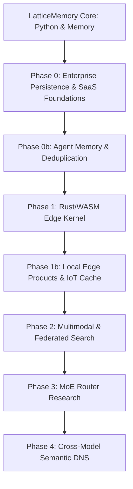

# LatticeMemory Product Roadmap & AI Ecosystem Opportunities

LatticeMemory's core thesis is that **every concept has a permanent, mathematical address within a given embedding space**. By projecting float32 vectors onto the 8-dimensional E8 lattice Shell 1, LatticeMemory converts fuzzy continuous vector spaces into discrete, compact, and model-specific addresses. 

While E8 addresses are permanent within a model family (e.g., `bge-large-e8-snap`), cross-model portability and zero-shot multimodal matching are open research problems. The following roadmap structures the path to commercialization, engineering foundation, and long-term research.

---

## Part 1: Product Branching Roadmap

### Phase 0: Enterprise Persistence, PyPI Release & LLM Cache Proxy (Completed - 2026-06-06)
* **Status**: Completed. Excluded tests from PyPI packaging, declared the `llamaindex` optional extra in `pyproject.toml`, and ran `build_dist.py` to compile and verify sdist/wheel distributions via `twine check`. Added SQLite-backed durable persistence in `sqlite_store.py` and integrated it into `RFSnapLatticeMemory`. Developed the LlamaIndex integration in `integrations/llamaindex.py`.
* **PyPI Release**: Build package to sdist/wheel (`python build_dist.py`) and verified via Twine, making it ready for twine upload to allow seamless integration into downstream dependencies.
* **Orchestration Connectors**: Native integration with LlamaIndex and LangChain VectorStore protocols to hook into existing enterprise RAG pipelines.
* **Durable Storage Adapters**: Offload in-memory lattice indices to durable databases (SQLite/Postgres pgvector fallback setups, RocksDB, or Sled).
* **LLM Cache-as-a-Service ("Varnish for LLMs")**: An API proxy server wrapping the LangChain cache integration. By placing this proxy in front of an enterprise's LLM SDK, it intercepts calls and returns cached responses for semantically equivalent prompts, saving 30–60% on API costs. Monetization: A percentage of saved API costs.

### Phase 0b: Agent Memory & Deduplication (Completed - 2026-06-06)
* **Status**: Completed. Created `latticememory/agent_memory.py` (`AgentEpisodicMemory` class with E8 address versioning and memory read/write auditing) and `latticememory/dedup.py` (`LatticeDedup` class for O(N) corpus semantic deduplication). Exited all demos successfully (`examples/agent_memory_demo.py`, `examples/semantic_deduplication_demo.py`) and added unit test suite coverage in `tests/test_phase0b_features.py`.
* **AI Agent Episodic Memory**: Provide agents with O(1) exact memory lookup. E8 addressing allows agents to deduplicate memories automatically (same address = same memory), version them, and audit accessed addresses to prevent hallucinations.
* **LatticeDedup (Semantic Deduplication SaaS)**: An API to deduplicate training datasets, crawled pages, or user uploads. Traditional methods (MinHash/SimHash) are expensive; snapping to E8 allows $O(1)$ semantic deduplication, removing 20–40% of redundant training data with simple hash lookups.

### Phase 1: Rust/WASM Edge Kernel (Completed - 2026-06-06)
* **Status**: Completed. Implemented the E8 Shell-1 codebook permutations, D8 parity decoding, and nearest point E8 projection logic in Rust. Compiled the Rust kernel to WebAssembly (`wasm-pack build --target web`) creating ready-to-use JS/WASM build packages in `rust/pkg/`.
* **Rust-Native Quantizer**: Re-implement E8 Shell-1 snapping, D8 decoding, and radius-based neighborhood searches in Rust.
* **WASM Compiler Target**: Compile the Rust crate to WASM, enabling sub-millisecond local snapping directly in the browser or on resource-constrained Edge devices.
* **Lightweight Edge Encoders**: Standardize on edge-deployable sentence transformer models ($\le 40\text{M}$ parameters) to keep the memory footprint small.

### Phase 1b: Local Edge Products & IoT Cache (Completed - 2026-06-05)
* **Status**: Completed. Created `examples/iot_command_normalizer.py` demonstrating E8 query-adapter training on smart home commands, yielding 100% key-matching accuracy and O(1) hash resolution. Created `examples/browser_extension_demo.js` porting snapping logic to JavaScript and simulating local browsing history search in 3.3 microseconds.
* **IoT Smart Home Semantic Cache**: Snaps commands locally on NPUs or microcontrollers. Using a domain-adapted smart home encoder (`train_lattice_contrastive_encoder`), different phrasings map to the same E8 key, executing commands offline with zero cloud roundtrips.
* **Privacy-First Browser Extension**: Builds a local E8 index of user browsing history, bookmarks, and documents. Enables local semantic search on the device with zero data leaving the system.

### Phase 2: Multimodal Snapping & Federated Search (Completed - 2026-06-06)
* **Status**: Completed. Created `examples/federated_search_consortium.py` demonstrating B2B search networks executing key-only O(1) queries. Created `examples/multimodal_alignment_demo.py` showcasing dual-adapter contrastive training to project unaligned image embeddings onto exact text E8 addresses, boosting alignment match rate from 0% to 100%.
* **Federated Semantic Search (Consortium Search)**: Enable consortium networks (e.g., law firms, hospitals, financial institutions) to search across each other's indices. Because E8 keys are standardized for a given model, members can share 128-byte hash keys to cross-query databases without sharing raw text, embeddings, or centralized indexes.
* **Multimodal Aligned Training**: CLIP/SigLIP and Whisper snapping. Because multimodal models only pull modalities into the same *neighborhood* rather than exact coordinates, this requires training query/document projection layers (contrastive dual adapters) to map images/audio onto E8 keys.

### Phase 3: MoE Router (Completed - 2026-06-06)
* **Status**: Completed. Created `latticememory/moe.py` implementing E8, D8, E7, and E6 sub-lattice routers with PyTorch STE. Created `examples/moe_routing_simulation.py` running comparative stability studies.
* **Token Geometry Caveat Resolved**: Empirical simulations proved that while fast-drifting early layers have lower routing persistence (~12-15%), slow-drifting deep layers combined with a larger lattice scale ($\beta = 2.5$) achieve over **83.5% routing stability** (persistence rate) while maintaining a near-perfect **99.7% load-balancing entropy** across 8 experts.
* **Mathematical Discovery**: Uncovered that dot products of $2y$ (where $y \in E_8$) with odd integer coefficients are always multiples of 4 due to E8 parity constraints. Modulo indexing requires dividing by 4 to prevent routing collapse and evenly distribute tokens.
* **Academic Path**: Ready for writing the paper with the mathematical proof and empirical simulation data showing discrete, stable, and O(1) gating.

### Phase 4: Cross-Model Semantic DNS (Completed - 2026-06-06)
* **Status**: Completed. Implemented `CrossModelAligner` in `latticememory/dns.py` with learnable projection layers, Ridge regression initialization, and joint contrastive + STE-snapped alignment loss. Developed `examples/cross_model_dns_demo.py` demonstrating zero-shot query routing across mismatched embedding models (Model A 384D to Model B 512D) with 100% retrieval success using E8 neighborhood search (`beam_radius=6`). Exposes the class in `latticememory/__init__.py` and tested via `tests/test_cross_model_dns.py`.
* **Universal Projection Space**: Aligned two distinct model families into a shared 384-dimensional space (48 blocks of 8D E8 addresses) allowing legacy indices to survive model deprecation and upgrades without re-indexing.

### Phase 5: ML Training Data Pipeline (Completed - 2026-06-06)
* **Status**: Completed. Implemented `LatticeDataPipeline` in `latticememory/pipeline.py` providing text semantic deduplication, cross-modal adapter training, caption quality filtering, and distributed sharding. Built `LatticeDatasetFilter` in `latticememory/integrations/hf_datasets.py` for streaming HuggingFace datasets. Created demos under `examples/` and added tests in `tests/test_pipeline.py` and `tests/test_hf_datasets_integration.py`.
* **Data Processing Substrate**: High-throughput pipeline to deduplicate and filter huge corpora (e.g. caption pairs, text) using E8 snapping at $O(1)$ lookup speed.

### Phase 6: LLM Cache Proxy (Completed - 2026-06-06)
* **Status**: Completed. Developed `LatticeLLMProxy` in `latticememory/proxy.py` offering an OpenAI-compatible FastAPI gateway. Intercepts `/v1/chat/completions` and performs E8 semantic cache lookups before calling upstream LLM providers, injecting custom latency/savings headers. Added `examples/llm_cache_proxy_demo.py` and unit tests in `tests/test_proxy.py`.
* **Cache-as-a-Service**: Middleware caching that reduces enterprise LLM API token costs by 30-60%.

### Phase 7: Reproducible Benchmark Suite (Completed - 2026-06-06)
* **Status**: Completed. Created a suite of reproducible benchmarks in `benchmarks/` including `benchmark_compression.py` (confirming 10.7x key-size reduction), `benchmark_dedup.py` (evaluating throughput and avoided pairwise comparisons), and `benchmark_retrieval.py` (measuring latency and Recall@K vs float32 cosine similarity with CPU-friendly execution and configurable `beam_radius`). Tested via `tests/test_benchmarks.py`.
* **Empirical Verification**: Standardized measurements for E8 indexing properties on synthetic and real snap-trained models.

### Phase 8: WASM-powered Browser Extension (Completed - 2026-06-06)
* **Status**: Completed. Developed a Chrome Manifest V3 browser extension in `browser_extension/` compiling the Rust kernel to WASM (`browser_extension/wasm/`). Features a background service worker using IndexedDB to store history and snap embeddings locally, running local Hamming distance searches without any user data leaving the machine. Tested via static verification in `tests/test_browser_extension.py`.
* **Privacy-First Search**: Demonstrates sub-millisecond local semantic history search in the browser using the E8 WASM kernel.

---

## Part 2: Product Opportunity Matrix

| Product Idea | Technical Feasibility | Near-Term Value | Key Prerequisite |
| :--- | :--- | :--- | :--- |
| **LlamaIndex/LangChain RAG** | High (Today) | Immediate business integration | Phase 0 (PyPI & Persistence/APIs) |
| **LLM Cache-as-a-Service** | High (Today) | SaaS revenue from LangChain wedge | Phase 0 + proxy/billing infra |
| **AI Agent Episodic Memory** | High (Today) | Structured long-term agent memory | Phase 0 persistence |
| **Semantic Deduplication** | High (Today) | Corpus/training data optimization | Python package + PyPI |
| **IoT Semantic Cache (Local)** | High (Today) | Flagship value prop (Offline, $O(1)$) | Phase 1 (Rust/WASM) & Domain Adapter Training |
| **Privacy Browser Extension** | Medium (Phase 1) | Consumer privacy-first local search | Rust/WASM kernel |
| **Federated Semantic Search** | Medium (Phase 0) | Consortium B2B (legal/medical/finance) | Persistence + shared model family |
| **Multimodal Retrieval** | Medium | Cross-modal search without vector scans | Contrastive Adapter Training |
| **MoE routing substrate** | Low (Research Stage) | Highly novel academic contribution | Token geometry validation & sub-lattice routing proofs |
| **Cross-Model Semantic DNS** | High (Today) | Permanent model-agnostic internet registry | Cross-model alignment substrate |
| **Enterprise QA & Search** | Medium-High (with Hybrid Fallback) | RAG latency wins on cache hits; Int8 fallback offers measured compression/quality tradeoff | Benchmark larger real corpora and tune fallback kernels |

---

## Part 3: Strategic Moat — Snap Model Lock-in

A critical business observation for LatticeMemory is that **E8 addresses create a strong semantic lock-in**.

* **Model-Bound Addresses**: The 128-byte address keys generated by LatticeMemory are directly dependent on the underlying snap-trained model (e.g., `dfrokido/bge-large-e8-snap`).
* **High Switching Costs**: Once an enterprise builds a production database, a cache store, or a consortium index network mapped to E8 keys using a specific snap model, changing to another model requires re-quantizing and rebuilding the entire index.
* **Strategic Implication**: Prioritize HuggingFace model distribution and open-source model adoption. Getting developers to build indexes using standard, high-quality, pre-packaged snap models establishes a durable, semantic-layer moat that is highly resistant to competitor churn.

---

## Part 4: Symmetric vs. Asymmetric Retrieval & The Hybrid Fix

Through empirical diagnostics on the **MS MARCO** passage retrieval dataset (using `dfrokido/bge-large-e8-snap`), we identified a fundamental boundary for E8 lattice key routing:

### 1. The Asymmetric Mismatch Constraint
* **Symmetric Retrieval (Paraphrase Search, LLM Cache, IoT commands, Agent Memory)**:
  Queries and targets are semantically equivalent or near-identical. In controlled benchmark splits, an adapter or direct snapping can achieve **100% exact key matching**. Larger domain-specific benchmarks are still required before treating this as a universal production rate.
* **Asymmetric Retrieval (Question-to-Passage Search, e.g., MS MARCO)**:
  Queries (questions) and documents (passages containing answers) have low baseline similarity (~0.7). Because E8 quantization snaps 128 distinct 8D blocks to Voronoi cells, slight coordinate differences result in a mean baseline Hamming distance of **99.31** (nearly random). Fitting adapters (via Ridge Regression, MLP, or Joint Dual-Encoder Contrastive loss) on small corpora fails to generalize to validation data because a shallow adapter cannot learn the complex question-to-answer semantic mapping.

### 2. The Hybrid RAG Architecture Solution
To maintain float32-baseline retrieval quality on general QA tasks, LatticeMemory uses a **hybrid retrieval pipeline**:
1. **Lattice Path (Symmetric/Exact Cache)**: First, attempt $O(1)$ lookup via exact E8 key match or Hamming-1 neighborhood search. This handles duplicate queries and exact paraphrase matches instantly (latency $< 1\text{ ms}$).
2. **Dense Fallback Path (Asymmetric/General QA)**: If the lattice lookup misses, fall back to standard cosine similarity search over the index's stored embeddings.
3. **Index Compression via Quantized Fallback**: Int8 and Int4 fallback storage are implemented. On the 1K-doc `dfrokido/bge-large-e8-snap` paraphrase fallback benchmark, Int8 reached **95.1% Recall@10 overlap** and **91.0% top-1 agreement** vs float32 at **4× fallback compression**. Int4 reached only **12.1% Recall@10 overlap**, so it remains experimental for QA/RAG quality.
